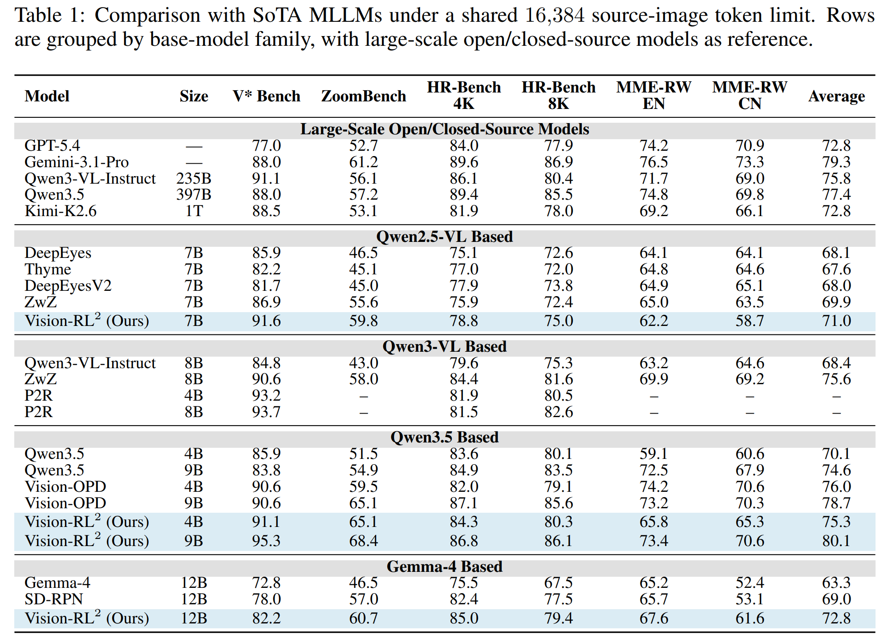

<div align="center">

# Vision-RL²

### Region-Level Policy Optimization for Fine-grained MLLM Perception

[arXiv] &nbsp;|&nbsp; [Project page](https://yuhengsss.github.io/VisionRL2/)


</div>

## Updates

- **Sep. 2026** &mdash; Training data released: SD-RPN corpora, the 7k RL pools and the
  evidence-map caches for all four backbones
  ([`YuhengSSS/VisionRL2-data`](https://huggingface.co/datasets/YuhengSSS/VisionRL2-data)),
  plus `data_prep/` drivers that regenerate every one of them.
- **Sep. 2026** &mdash; Gemma-4-12B-it (encoder-free backbone) support: SD-RPN twig, region-level RL, sparse RoI evaluation ([docs/GEMMA4.md](docs/GEMMA4.md)).
- **Sep. 2026** &mdash; Code release: SD-RPN online pseudo-label training, the region-level RL stage for four backbones, both evaluation protocols, and the [project page](https://yuhengsss.github.io/VisionRL2/).

## TODO

- [x] Release the Vision-RL² (stage-2) checkpoints on Hugging Face (see the table below);
      the SD-RPN (stage-1) checkpoints follow.
- [x] Release the RL pools and evidence-map caches, plus the SD-RPN training corpora
      ([`YuhengSSS/VisionRL2-data`](https://huggingface.co/datasets/YuhengSSS/VisionRL2-data)).
- [ ] Gradio RoI visualizer ported to the release code paths.

## Introduction

Fine-grained perception in multimodal large language models is usually bought with resolution,
and every extra visual token is paid twice: in the vision encoder and in the language model.
We start from a measurement. The two operations behind fine-grained perception, *localizing*
the region of interest (RoI) and *recognizing* its content, do not need the same resolution:
on a controlled ZoomBench diagnostic, localization tolerates roughly **3&ndash;4&times; stronger token
compression** than recognition. So localize on a coarse view and spend resolution only on the
selected evidence &mdash; which puts the whole burden on the RoI predictor.

The predictor is SD-RPN: three trainable blocks attached after block *K* of a **frozen** MLLM,
producing a dense RoI map from the last prefilling token in a single pass. It is first trained
with online self-distilled pseudo-labels, and then refined with **region-level RL**. The RoI
map is smoothed, thresholded at a peak-relative gate and split into connected components; the
top components are the *actions*. A frozen MLLM reader scores each action's masked image by the
log-odds of the gold answer, and a region's reward is its leave-one-out contribution. A
subtractive group prunes distracting proposals against a sample-specific noise margin measured
on control regions, an additive group recovers evidence the policy never proposed (from frozen
response-to-image attention), and only the small predictor is updated.

At inference, **sparse visual encoding** re-encodes the predicted crop at a zoom set by its
foreground occupancy and keeps only foreground tokens, so the evidence is seen finer under the
same token budget.

<div align="center"></div>

**Backbones**: Qwen3.5-4B, Qwen3.5-9B, Qwen2.5-VL-7B, and Gemma-4-12B-it (encoder-free).

## Main Results

### Main-table protocol (judged)

16,384-token source-image limit, option-list prompts with free-form responses (no short-answer
suffix), 2,048 new tokens; scoring = rule pass + Qwen3.5-9B LLM judge. See
[docs/PROTOCOLS.md](docs/PROTOCOLS.md). Base-model, Vision-OPD and ZwZ rows are re-evaluated on
released weights; other rows are quoted from their publications.

<div align="center"></div>

DeepEyes, ZwZ, P2R and Vision-OPD fine-tune the full MLLM; Vision-RL² updates only the small
attached predictor. Gemma-4 rows use the model's largest visual-token tier (1,120 tokens).

### Training-aligned protocol (rule metrics, no judge)

The regime the RL objective optimizes: short-answer prompting and benchmark-native metrics.

Qwen3.5-4B at the 576-token source limit (the training limit):

| Model | V* | ZoomBench | HR-4K | HR-8K | MME-RW Lite | InfoVQA | Avg. |
|---|---|---|---|---|---|---|---|
| Qwen3.5-4B (base) | 66.0 | 40.5 | 63.5 | 56.4 | 41.0 | 69.8 | 56.2 |
| SD-RPN (stage 1) | 82.7 | 55.6 | 71.1 | 63.3 | 48.9 | 78.1 | 66.6 |
| **Vision-RL² (ours)** | **85.3** | **61.8** | **77.4** | **70.9** | **51.0** | **80.5** | **71.1** |

Gemma-4-12B-it at source tier 1120 (RoI crop target 256 tokens):

| Model | V* | ZoomBench | HR-4K | HR-8K | MME-RW Lite | InfoVQA | Avg. |
|---|---|---|---|---|---|---|---|
| Gemma-4-12B-it (base) | 69.6 | 43.9 | 67.1 | 61.8 | 47.3 | 76.4 | 61.0 |
| SD-RPN (stage 1), dense crop | 75.4 | 50.9 | 72.9 | 71.1 | 48.1 | 78.3 | 66.1 |
| **Vision-RL² (ours)**, sparse crop | **82.2** | **56.2** | **77.6** | **73.4** | **51.0** | **79.1** | **69.9** |

At the 576-token limit the Qwen3.5-4B model exceeds the base model evaluated at 4,096 tokens by
more than three points with about a quarter of the visual tokens, and matches SD-RPN at 4,096
with 4.2&times; fewer visual tokens.

## Installation

One environment per backbone family; each file pins the versions the paper numbers were
produced with.

```bash
# Qwen3.5 (4B / 9B): transformers 5.6, torch 2.7, flash-attn 2.8, flash-linear-attention
conda create -n visionrl2 python=3.10 -y && conda activate visionrl2
pip install -r requirements.txt && pip install -e lmms-eval

# Qwen2.5-VL-7B: transformers 4.51, torch 2.4
conda create -n visionrl2-q25 python=3.10 -y && conda activate visionrl2-q25
pip install -r requirements_qwen2_5vl.txt && pip install -e lmms-eval

# Gemma-4-12B-it: transformers 5.15, torch 2.11, sdpa attention (no flash-attn, no DeepSpeed)
conda create -n visionrl2-gemma python=3.11 -y && conda activate visionrl2-gemma
pip install -r requirements_gemma4.txt && pip install -e lmms-eval
```

## Data

Two Hugging Face datasets hold everything the two stages read:
[`YuhengSSS/VisionRL2-data`](https://huggingface.co/datasets/YuhengSSS/VisionRL2-data)
(SD-RPN corpora, the 7k RL pools, evidence-map caches) and
[`YuhengSSS/RoITraining`](https://huggingface.co/datasets/YuhengSSS/RoITraining)
(the VisualCoT source images).

```bash
# training data: SD-RPN corpora, RL pools, evidence-map caches (~300 MB)
hf download YuhengSSS/VisionRL2-data --repo-type dataset --local-dir data/VisionRL2-data
mkdir -p data/ev_maps
for t in data/VisionRL2-data/ev_maps/*.tar; do tar -xf "$t" -C data/ev_maps; done

# images (VisualCoT sources): only the four archives the pipeline reads (~28 GB total)
hf download YuhengSSS/RoITraining --repo-type dataset --local-dir data/RoITraining \
  --include gqa.tar --include textvqa.tar --include infographicsvqa.tar \
  --include spdocvqa_images.tar.gz

mkdir -p datasets datasets/DocVQA
tar -xf data/RoITraining/gqa.tar             -C datasets   # -> datasets/gqa/images/
tar -xf data/RoITraining/textvqa.tar         -C datasets   # -> datasets/textvqa/train_images/
tar -xf data/RoITraining/infographicsvqa.tar -C datasets   # -> datasets/infographicsvqa/infographicsvqa_images/
tar -xzf data/RoITraining/spdocvqa_images.tar.gz -C datasets/DocVQA   # flat *.png -> datasets/DocVQA/
```

`RoITraining` also holds ~66 other files (label jsonl/pkl bundles and image archives for
other projects, ~74 GB in total); none of them are needed here, so do not clone the whole
repo. The four archives above are `gqa.tar` (10.3 GB), `spdocvqa_images.tar.gz` (8.6 GB),
`textvqa.tar` (7.1 GB) and `infographicsvqa.tar` (2.0 GB).

`DATASET_ROOT` (default `datasets`) then holds one folder per source dataset
(`gqa/images/`, `DocVQA/`, `textvqa/train_images/`, `infographicsvqa/infographicsvqa_images/`),
and every script's data defaults (`data/VisionRL2-data/...`, `EV_MAPS_ROOT=data/ev_maps`)
already point at this layout, so the commands below need no data arguments.

Every released file can be rebuilt from scratch with the drivers in `data_prep/` — candidate
split, stage-1 corpus generation, pre-RL filtering, pool composition and the evidence-map
cache. See [data_prep/README.md](data_prep/README.md) for the full regeneration pipeline.

## Training

```bash
# ---- stage 1: SD-RPN ----
MODEL=qwen3_5-4b DATASET_ROOT=datasets bash scripts/train_sdrpn_online.sh
MODEL=qwen3_5-9b DATASET_ROOT=datasets GPU_IDS=0,1,2,3 bash scripts/train_sdrpn_online.sh

IMAGE_ROOT=datasets START=train GPU_IDS=0,1 \
  bash scripts/train_sdrpn_gemma4.sh          # Gemma-4: train -> assemble
                                              # (START=gen re-generates the corpus first)

# ---- stage 2: region-level RL (one script per backbone) ----
PHASE_A_CKPT=output/sdrpn/qwen3_5-4b-sdrpn-K21T3 DATASET_ROOT=datasets \
  bash scripts/train_rl_qwen3_5_4b.sh

PHASE_A_CKPT=output/sdrpn/qwen3_5-9b-sdrpn-K21T3 DATASET_ROOT=datasets \
  bash scripts/train_rl_qwen3_5_9b.sh

PHASE_A_CKPT=output/sdrpn/qwen2_5vl-7b-sdrpn-K18T3 DATASET_ROOT=datasets GPU_IDS=0,1 \
  bash scripts/train_rl_qwen2_5vl_7b.sh

PHASE_A_CKPT=output/sdrpn/gemma4-12b-sdrpn-K27T3 \
DATASET_ROOT=datasets GPU_IDS=0,1 \
  bash scripts/train_rl_gemma4_12b.sh
```

Stage 1 writes `output/sdrpn/qwen3_5-{4b,9b}-sdrpn-K21T3`; the Gemma driver trains a twig
delta into `output/sdrpn/gemma4-12b-sdrpn-K27T3-delta` and its `assemble` stage turns that into
the loadable `output/sdrpn/gemma4-12b-sdrpn-K27T3` (tiers, twig and crop rules:
[docs/GEMMA4.md](docs/GEMMA4.md)). The Qwen2.5-VL-7B SD-RPN checkpoint
(`output/sdrpn/qwen2_5vl-7b-sdrpn-K18T3`) is released as-is, so only stage 2 has to be run for
it.

Each stage-2 script defaults `FILTERED_JSONL` to its released pool
(`data/VisionRL2-data/rl_pools/rl_pool_<backbone>.jsonl`) and `EV_MAPS_ROOT` to
`data/ev_maps`; pass your own to train on a pool you rebuilt
(see [data_prep/README.md](data_prep/README.md)).

## Evaluation

```bash
# ---- main table (generation + judge) ----
MODEL=qwen3_5 CHECKPOINT=output/rl/<run> bash scripts/main_eval.sh
CHECKPOINT=output/rl/<gemma run> GPU_IDS=0,1 bash scripts/main_eval_gemma4.sh

# ---- training-aligned protocol ----
MODEL=qwen3_5 CHECKPOINT=output/rl/<run> CAP=576 bash scripts/aligned_eval.sh
MODEL=qwen3_5 CHECKPOINT=Qwen/Qwen3.5-4B BASE=1 CAP=576 bash scripts/aligned_eval.sh
for CAP in 576 1024 2048 4096; do MODEL=qwen3_5 CHECKPOINT=output/rl/<run> CAP=$CAP bash scripts/aligned_eval.sh; done

CHECKPOINT=output/rl/<gemma run>              bash scripts/aligned_eval_gemma4.sh   # sparse crop
CHECKPOINT=output/sdrpn/gemma4-12b-sdrpn-K27T3 ROI_MODE=dense bash scripts/aligned_eval_gemma4.sh   # dense crop
CHECKPOINT=output/sdrpn/gemma4-12b-sdrpn-K27T3 BASE=1         bash scripts/aligned_eval_gemma4.sh   # base row
```

The Gemma scripts take `ROI_MODE=dense|sparse` (default `sparse`) and `BASE=1`; the arms map
onto `timing_mode = roi_dense | roi_sparse | baseline`. See [docs/PROTOCOLS.md](docs/PROTOCOLS.md)
and [docs/GEMMA4.md](docs/GEMMA4.md).

## Checkpoints

| Backbone | Twig | SD-RPN (stage 1) | Vision-RL² (stage 2) |
|---|---|---|---|
| [Qwen3.5-4B](https://huggingface.co/Qwen/Qwen3.5-4B) | K = 21, T = 3 | TBA | [VisionRL2-Qwen3.5-4B](https://huggingface.co/YuhengSSS/VisionRL2-Qwen3.5-4B) |
| [Qwen3.5-9B](https://huggingface.co/Qwen/Qwen3.5-9B) | K = 21, T = 3 | TBA | [VisionRL2-Qwen3.5-9B](https://huggingface.co/YuhengSSS/VisionRL2-Qwen3.5-9B) |
| [Qwen2.5-VL-7B](https://huggingface.co/Qwen/Qwen2.5-VL-7B-Instruct) | K = 18, T = 3 | TBA | [VisionRL2-Qwen2.5-VL-7B](https://huggingface.co/YuhengSSS/VisionRL2-Qwen2.5-VL-7B) |
| [Gemma-4-12B-it](https://huggingface.co/google/gemma-4-12B-it) | K = 27, T = 3 | TBA | [VisionRL2-Gemma-4-12B](https://huggingface.co/YuhengSSS/VisionRL2-Gemma-4-12B) |

The stage-2 (Vision-RL²) repositories are private for now and hold full model directories
(frozen backbone + trained twig): download one and pass its path as `CHECKPOINT` to
`scripts/main_eval*.sh` / `scripts/aligned_eval*.sh`. The SD-RPN (stage-1) checkpoints follow.

Stage-1 checkpoints load from `output/sdrpn/{qwen3_5-4b-sdrpn-K21T3, qwen3_5-9b-sdrpn-K21T3,
qwen2_5vl-7b-sdrpn-K18T3, gemma4-12b-sdrpn-K27T3}`; stage-2 runs land under `output/rl/`.

Only the twig is trained, so a checkpoint can also be published as a twig-only delta
(`tools/compress_twig.py`); the Gemma stage-1 run writes such a delta natively and
`qwen_src/gemma4_unified/assemble_full_checkpoint.py` turns it back into a loadable directory.

## Citation

```bibtex
@article{shi2026visionrl2,
  title   = {Region-Level Policy Optimization for Fine-grained MLLM Perception},
  author  = {Shi, Yuheng and Pei, Xiaohuan and Dong, Minjing and Xu, Chang},
  journal = {arXiv preprint},
  year    = {2026}
}

@inproceedings{shi2026sdrpn,
  title     = {Catching the Details: Self-Distilled RoI Predictors for Fine-Grained MLLM Perception},
  author    = {Shi, Yuheng and Pei, Xiaohuan and Dong, Minjing and Xu, Chang},
  booktitle = {ICLR},
  year      = {2026}
}
```

## Acknowledgement

Built on [Qwen2.5-VL](https://github.com/QwenLM/Qwen2.5-VL), [Qwen3-VL](https://github.com/QwenLM/Qwen3-VL),
[Gemma](https://github.com/google-deepmind/gemma), [lmms-eval](https://github.com/EvolvingLMMs-Lab/lmms-eval),
and our own [SD-RPN](https://github.com/YuHengsss/SD-RPN). The RL pool is derived from
[Visual-CoT](https://github.com/deepcs233/Visual-CoT).
