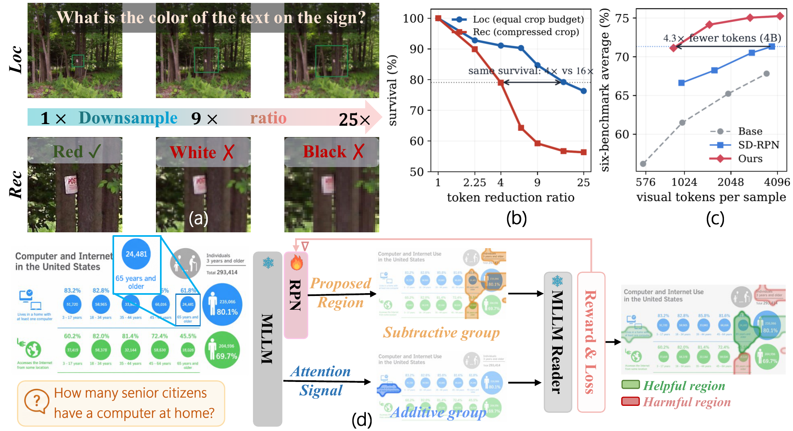
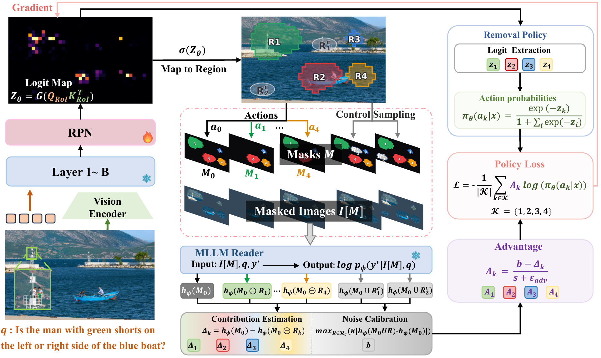

<div align="center">

# Vision-RL²

### Region-Level Policy Optimization for Fine-grained MLLM Perception

Yuheng Shi<sup>1</sup>, Xiaohuan Pei<sup>1</sup>, Minjing Dong<sup>2</sup>, Chang Xu<sup>1</sup>

<sup>1</sup>University of Sydney &nbsp;&nbsp; <sup>2</sup>City University of Hong Kong

[arXiv] &nbsp;|&nbsp; [Project page](project_page/index.html) &nbsp;|&nbsp; [Protocols](docs/PROTOCOLS.md) &nbsp;|&nbsp; [Gemma-4 notes](docs/GEMMA4.md)



</div>

## Updates

- **Sep. 2026** &mdash; Gemma-4-12B-it (encoder-free backbone) support: SD-RPN twig, region-level RL, sparse RoI evaluation ([docs/GEMMA4.md](docs/GEMMA4.md)).
- **Sep. 2026** &mdash; Code release: SD-RPN online pseudo-label training, the region-level RL stage for four backbones, both evaluation protocols, and the project page.

## TODO

- [ ] Release the SD-RPN and Vision-RL² checkpoints on Hugging Face (see the table below).
- [ ] Release the RL pools and evidence-map caches, plus the SD-RPN training corpora.
- [ ] Gradio RoI visualizer ported to the release code paths.

## Introduction

Fine-grained perception in multimodal large language models is usually bought with resolution,
and every extra visual token is paid twice: in the vision encoder and in the language model.
We start from a measurement. The two operations behind fine-grained perception, *localizing*
the region of interest (RoI) and *recognizing* its content, do not need the same resolution:
on a controlled ZoomBench diagnostic, localization tolerates roughly **3&ndash;4&times; stronger token
compression** than recognition. So localize on a coarse view and spend resolution only on the
selected evidence &mdash; which puts the whole burden on the RoI predictor.

The predictor is SD-RPN: three trainable blocks attached after block *K* of a **frozen** MLLM,
producing a dense RoI map from the last prefilling token in a single pass. It is first trained
with online self-distilled pseudo-labels, and then refined with **region-level RL**. The RoI
map is smoothed, thresholded at a peak-relative gate and split into connected components; the
top components are the *actions*. A frozen MLLM reader scores each action's masked image by the
log-odds of the gold answer, and a region's reward is its leave-one-out contribution. A
subtractive group prunes distracting proposals against a sample-specific noise margin measured
on control regions, an additive group recovers evidence the policy never proposed (from frozen
response-to-image attention), and only the small predictor is updated.

At inference, **sparse visual encoding** re-encodes the predicted crop at a zoom set by its
foreground occupancy and keeps only foreground tokens, so the evidence is seen finer under the
same token budget.

<div align="center"></div>

**Backbones**: Qwen3.5-4B, Qwen3.5-9B, Qwen2.5-VL-7B, and Gemma-4-12B-it (encoder-free).

## Main Results

### Main-table protocol (judged)

16,384-token source-image limit, option-list prompts with free-form responses (no short-answer
suffix), 2,048 new tokens; scoring = rule pass + Qwen3.5-9B LLM judge. See
[docs/PROTOCOLS.md](docs/PROTOCOLS.md). Base-model, Vision-OPD and ZwZ rows are re-evaluated on
released weights; other rows are quoted from their publications.

| Model | Size | V* Bench | ZoomBench | HR-Bench 4K | HR-Bench 8K | MME-RW EN | MME-RW CN | Avg. |
|---|---|---|---|---|---|---|---|---|
| *Large-scale open / closed-source* | | | | | | | | |
| GPT-5.4 | — | 77.0 | 52.7 | 84.0 | 77.9 | 74.2 | 70.9 | 72.8 |
| Gemini-3.1-Pro | — | 88.0 | 61.2 | 89.6 | 86.9 | 76.5 | 73.3 | 79.3 |
| Qwen3-VL-Instruct | 235B | 91.1 | 56.1 | 86.1 | 80.4 | 71.7 | 69.0 | 75.8 |
| Qwen3.5 | 397B | 88.0 | 57.2 | 89.4 | 85.5 | 74.8 | 69.8 | 77.4 |
| Kimi-K2.6 | 1T | 88.5 | 53.1 | 81.9 | 78.0 | 69.2 | 66.1 | 72.8 |
| *Qwen2.5-VL based* | | | | | | | | |
| DeepEyes | 7B | 85.9 | 46.5 | 75.1 | 72.6 | 64.1 | 64.1 | 68.1 |
| Thyme | 7B | 82.2 | 45.1 | 77.0 | 72.0 | 64.8 | 64.6 | 67.6 |
| DeepEyesV2 | 7B | 81.7 | 45.0 | 77.9 | 73.8 | 64.9 | 65.1 | 68.0 |
| ZwZ | 7B | 86.9 | 55.6 | 75.9 | 72.4 | 65.0 | 63.5 | 69.9 |
| **Vision-RL² (ours)** | 7B | 91.6 | 59.8 | 78.8 | 75.0 | 62.2 | 58.7 | 71.0 |
| *Qwen3-VL based* | | | | | | | | |
| Qwen3-VL-Instruct | 8B | 84.8 | 43.0 | 79.6 | 75.3 | 63.2 | 64.6 | 68.4 |
| ZwZ | 8B | 90.6 | 58.0 | 84.4 | 81.6 | 69.9 | 69.2 | 75.6 |
| P2R | 4B | 93.2 | – | 81.9 | 80.5 | – | – | – |
| P2R | 8B | 93.7 | – | 81.5 | 82.6 | – | – | – |
| *Qwen3.5 based* | | | | | | | | |
| Qwen3.5 | 4B | 85.9 | 51.5 | 83.6 | 80.1 | 59.1 | 60.6 | 70.1 |
| Qwen3.5 | 9B | 83.8 | 54.9 | 84.9 | 83.5 | 72.5 | 67.9 | 74.6 |
| Vision-OPD | 4B | 90.6 | 59.5 | 82.0 | 79.1 | 74.2 | 70.6 | 76.0 |
| Vision-OPD | 9B | 90.6 | 65.1 | 87.1 | 85.6 | 73.2 | 70.3 | 78.7 |
| **Vision-RL² (ours)** | 4B | 91.1 | 65.1 | 84.3 | 80.3 | 65.8 | 65.3 | 75.3 |
| **Vision-RL² (ours)** | 9B | **95.3** | **68.4** | 86.8 | 86.1 | 73.4 | 70.6 | **80.1** |

DeepEyes, ZwZ, P2R and Vision-OPD fine-tune the full MLLM; Vision-RL² updates only the small
attached predictor.

**Gemma-4-12B-it** (encoder-free; source tier 1120, RoI crop target 384 tokens):

| Model | V* Bench | ZoomBench | HR-Bench 4K | HR-Bench 8K | MME-RW EN | MME-RW CN | Avg. |
|---|---|---|---|---|---|---|---|
| Gemma-4-12B-it (base) | 72.8 | 46.5 | 75.5 | 67.5 | 65.2 | 52.4 | 63.3 |
| SD-RPN (stage 1), dense crop | 78.0 | 57.0 | 82.4 | 77.5 | 65.7 | 53.1 | 69.0 |
| **Vision-RL² (ours)**, sparse crop | **82.2** | **60.7** | **85.0** | **79.4** | **67.6** | **61.6** | **72.8** |

### Training-aligned protocol (rule metrics, no judge)

The regime the RL objective optimizes: short-answer prompting and benchmark-native metrics.

Qwen3.5-4B at the 576-token source limit (the training limit):

| Model | V* | ZoomBench | HR-4K | HR-8K | MME-RW Lite | InfoVQA | Avg. |
|---|---|---|---|---|---|---|---|
| Qwen3.5-4B (base) | 66.0 | 40.5 | 63.5 | 56.4 | 41.0 | 69.8 | 56.2 |
| SD-RPN (stage 1) | 82.7 | 55.6 | 71.1 | 63.3 | 48.9 | 78.1 | 66.6 |
| **Vision-RL² (ours)** | **85.3** | **61.8** | **77.4** | **70.9** | **51.0** | **80.5** | **71.1** |

Gemma-4-12B-it at source tier 1120 (RoI crop target 256 tokens):

| Model | V* | ZoomBench | HR-4K | HR-8K | MME-RW Lite | InfoVQA | Avg. |
|---|---|---|---|---|---|---|---|
| Gemma-4-12B-it (base) | 69.6 | 43.9 | 67.1 | 61.8 | 47.3 | 76.4 | 61.0 |
| SD-RPN (stage 1), dense crop | 75.4 | 50.9 | 72.9 | 71.1 | 48.1 | 78.3 | 66.1 |
| **Vision-RL² (ours)**, sparse crop | **82.2** | **56.2** | **77.6** | **73.4** | **51.0** | **79.1** | **69.9** |

At the 576-token limit the Qwen3.5-4B model exceeds the base model evaluated at 4,096 tokens by
more than three points with about a quarter of the visual tokens, and matches SD-RPN at 4,096
with 4.2&times; fewer visual tokens.

## Layout

```
qwen_src/
  qwen3_5/, qwen2_5_vl/     Qwen model code with the SD-RPN predictor
  roi/                      two-stage RoI inference, crop budget, sparse encoding
  gemma4_unified/           Gemma-4 fork: modeling with the twig, stage-1 corpus
                            generation + training, checkpoint assembly,
                            roi_inference.py / roi_sparse.py (dense vs Mode-B crop)
qwen-vl-finetune/
  qwenvl/train/train_qwen.py              stage 1: SD-RPN online pseudo-label training
  qwenvl/train/region_level_grpo/         stage 2: region-level RL
    trainer.py, actions.py, components.py, reward_model.py, ref_twig.py
    gemma_support.py                      Gemma-4 family plumbing for stage 2
lmms-eval/                  evaluation fork (models: qwen3_5, qwen2_5_vl, gemma4)
scripts/
  train_sdrpn_online.sh         stage 1 (MODEL=qwen3_5-4b | qwen3_5-9b)
  train_sdrpn_gemma4.sh         stage 1 for Gemma-4-12B (tier 560, v4mix corpus)
  train_rl_qwen3_5_4b.sh        stage 2, one script per backbone
  train_rl_qwen3_5_9b.sh
  train_rl_qwen2_5vl_7b.sh
  train_rl_gemma4_12b.sh
  main_eval.sh / main_eval_gemma4.sh        main-table protocol (generation + judge)
  aligned_eval.sh / aligned_eval_gemma4.sh  training-aligned protocol
  main_table_judge.py           rule pass + Qwen3.5-9B judge
  _make_id_shards.py            QZOOM_DOC_IDS_FILE shard builder
data_prep/
  pre_rl_filter.py, make_filtered_v2.py     RL pool selection
  gen_pool_evidence_gemma.py, build_evidence_map_cache_gemma.py
  build_pool_gemma4.sh                      end-to-end Gemma pool builder
tools/                      twig-only checkpoint compression / reassembly
project_page/               the bilingual project page
docs/PROTOCOLS.md           the two evaluation protocols
docs/GEMMA4.md              Gemma-4 tiers, twig, crop rules, judging
```

## Installation

One environment per backbone family; each file pins the versions the paper numbers were
produced with.

```bash
# Qwen3.5 (4B / 9B): transformers 5.6, torch 2.7, flash-attn 2.8, flash-linear-attention
conda create -n visionrl2 python=3.10 -y && conda activate visionrl2
pip install -r requirements.txt && pip install -e lmms-eval

# Qwen2.5-VL-7B: transformers 4.51, torch 2.4
conda create -n visionrl2-q25 python=3.10 -y && conda activate visionrl2-q25
pip install -r requirements_qwen2_5vl.txt && pip install -e lmms-eval

# Gemma-4-12B-it: transformers 5.15, torch 2.11, sdpa attention (no flash-attn, no DeepSpeed)
conda create -n visionrl2-gemma python=3.12 -y && conda activate visionrl2-gemma
pip install -r requirements_gemma4.txt && pip install -e lmms-eval
```

## Data

Both stages read images from `DATASET_ROOT` (one folder per source dataset: `gqa`, `textvqa`,
`DocVQA`, `infographicsvqa`, …).

**Stage 1** consumes a response corpus generated by the frozen backbone itself, one row per QA
(`question_id`, `dataset`, `image`, `question`, `version`, `response`). For Qwen the corpora are
`qwen35_{4b,9b}_vcot50k_MIX.jsonl`; for Gemma the corpus is regenerated at tier 560 by
`scripts/train_sdrpn_gemma4.sh` itself (stage `gen`).

**Stage 2** consumes an RL pool jsonl, one row per QA (`dataset`, `image`, `question`,
`gold_answer`, `ev_maps_path`), where `ev_maps_path` points at the cached evidence maps of that
row (relative paths resolve against `EV_MAPS_ROOT`, then the pool's directory). The pool is
built with each backbone's **own** SD-RPN checkpoint:

```bash
# Gemma-4-12B: filter -> compose (5k infovqa + 1k textvqa + 1k docvqa) -> evidence -> maps
PHASE_A_CKPT=output/sdrpn/gemma4-12b-roi-K27T3-stage1-v4mix-full \
SOURCE_JSONL=data/rl_pools/vcot50k_source.jsonl IMAGE_ROOT=datasets GPU_IDS=0,1 \
  bash data_prep/build_pool_gemma4.sh
```

## Training

```bash
# ---- stage 1: SD-RPN ----
MODEL=qwen3_5-4b ROI_DATA_PATH=data/sdrpn/qwen35_4b_vcot50k_MIX.jsonl DATASET_ROOT=datasets \
  bash scripts/train_sdrpn_online.sh

IMAGE_ROOT=datasets INPUT_V1=data/sdrpn/gemma4_v4mix_input_v1.jsonl \
INPUT_V2=data/sdrpn/gemma4_v4mix_input_v2.jsonl GPU_IDS=0,1 \
  bash scripts/train_sdrpn_gemma4.sh          # Gemma-4: gen -> merge -> train -> assemble

# ---- stage 2: region-level RL (one script per backbone) ----
PHASE_A_CKPT=output/sdrpn/qwen3_5-4b-sdrpn-K21T3-online \
FILTERED_JSONL=data/rl_pools/filtered_v2_evmaps_4b.jsonl DATASET_ROOT=datasets \
  bash scripts/train_rl_qwen3_5_4b.sh

PHASE_A_CKPT=output/sdrpn/gemma4-12b-roi-K27T3-stage1-v4mix-full \
FILTERED_JSONL=data/rl_pools/gemma4_12b/pool/filtered_v2_evmaps_gemma.jsonl \
DATASET_ROOT=datasets GPU_IDS=0,1 \
  bash scripts/train_rl_gemma4_12b.sh
```

The Qwen2.5-VL-7B SD-RPN checkpoint is released as-is, so only stage 2 has to be run for it.

## Evaluation

```bash
# ---- main table (generation + judge) ----
MODEL=qwen3_5 CHECKPOINT=output/rl/<run> bash scripts/main_eval.sh
CHECKPOINT=output/rl/<gemma run> GPU_IDS=0,1 bash scripts/main_eval_gemma4.sh

# ---- training-aligned protocol ----
MODEL=qwen3_5 CHECKPOINT=output/rl/<run> CAP=576 bash scripts/aligned_eval.sh
MODEL=qwen3_5 CHECKPOINT=Qwen/Qwen3.5-4B BASE=1 CAP=576 bash scripts/aligned_eval.sh
for CAP in 576 1024 2048 4096; do MODEL=qwen3_5 CHECKPOINT=output/rl/<run> CAP=$CAP bash scripts/aligned_eval.sh; done

CHECKPOINT=output/rl/<gemma run>              bash scripts/aligned_eval_gemma4.sh   # sparse crop
CHECKPOINT=<gemma sd-rpn full> ROI_MODE=dense bash scripts/aligned_eval_gemma4.sh   # dense crop
CHECKPOINT=<gemma sd-rpn full> BASE=1         bash scripts/aligned_eval_gemma4.sh   # base row
```

The Gemma scripts take `ROI_MODE=dense|sparse` (default `sparse`) and `BASE=1`; the arms map
onto `timing_mode = roi_dense | roi_sparse | baseline`. See [docs/PROTOCOLS.md](docs/PROTOCOLS.md)
and [docs/GEMMA4.md](docs/GEMMA4.md).

## Checkpoints

| Backbone | Twig | SD-RPN (stage 1) | Vision-RL² (stage 2) |
|---|---|---|---|
| Qwen3.5-4B | K = 21, T = 3 | TBA | TBA |
| Qwen3.5-9B | K = 21, T = 3 | TBA | TBA |
| Qwen2.5-VL-7B | K = 18, T = 3 | TBA | TBA |
| Gemma-4-12B-it | K = 27, T = 3 | TBA | TBA |

Only the twig is trained, so a checkpoint can also be published as a twig-only delta
(`tools/compress_twig.py`); the Gemma stage-1 run writes such a delta natively and
`qwen_src/gemma4_unified/assemble_full_checkpoint.py` turns it back into a loadable directory.

## Citation

```bibtex
@article{shi2026visionrl2,
  title   = {Region-Level Policy Optimization for Fine-grained MLLM Perception},
  author  = {Shi, Yuheng and Pei, Xiaohuan and Dong, Minjing and Xu, Chang},
  journal = {arXiv preprint},
  year    = {2026}
}

@article{shi2026sdrpn,
  title   = {Catching the Details: Self-Distilled RoI Predictors for Fine-Grained MLLM Perception},
  author  = {Shi, Yuheng and Pei, Xiaohuan and Dong, Minjing and Xu, Chang},
  journal = {arXiv preprint arXiv:2509.16944},
  year    = {2026}
}
```

## Acknowledgement

Built on [Qwen2.5-VL](https://github.com/QwenLM/Qwen2.5-VL), [Qwen3-VL](https://github.com/QwenLM/Qwen3-VL),
[Gemma](https://github.com/google-deepmind/gemma), [lmms-eval](https://github.com/EvolvingLMMs-Lab/lmms-eval),
and our own [SD-RPN](https://github.com/YuHengsss/SD-RPN). The RL pool is derived from
[Visual-CoT](https://github.com/deepcs233/Visual-CoT).
